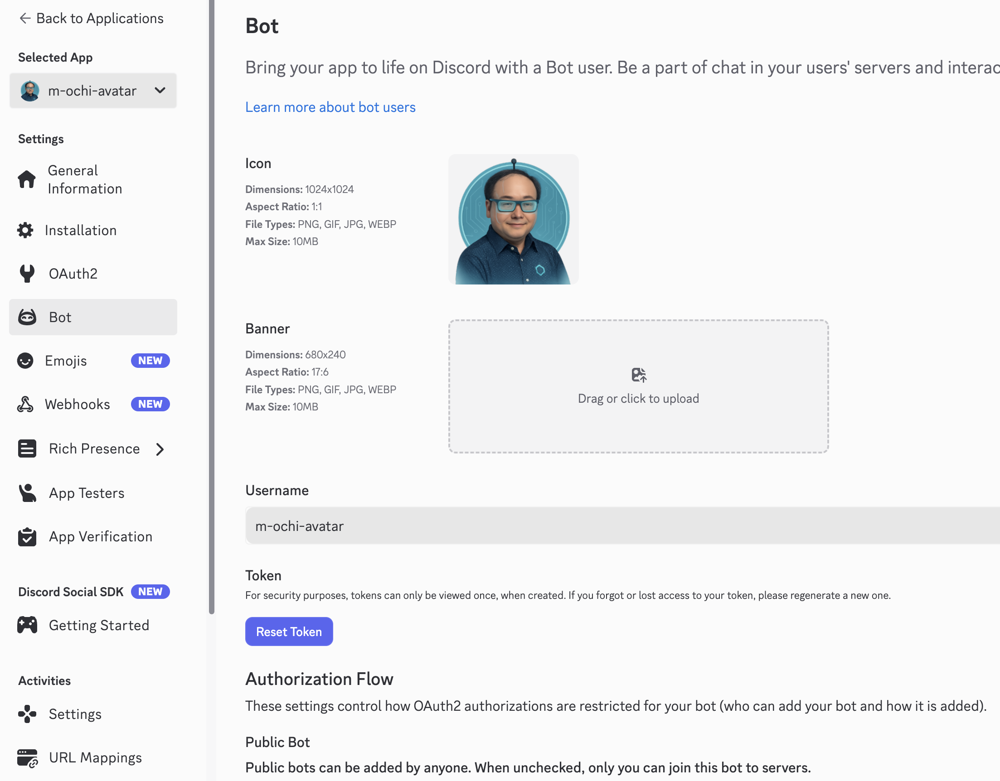

# AI Avatar for Discord
Discord上でAI Avatarを介して議論を行うためのAvatarです。

## 想定する会話手段
- 必ずAI Agentを通して議論を行う

## しくみ

Discordの[BOT](https://discord.com/developers/applications)という機能を使って実現します。

## 実行方法

### 実行環境の構築
1. このプロジェクトをforkして自分のリポジトリにしてください
1. forkしたプロジェクトをgit cloneしてください
1. `cd aiavatar4discord`
1. uv sync
1. `. .venv/bin/activate`

### Discordへの登録
1. Ochilabに登録または招待される
2. #agent_discussion チャンネルに招待される（開発時は別のチャンネルを作ってやってください）

### 準備
1. GEMINIのAPIキーの取得
    - GEMINIのAPIキーは[Google Cloudのコンソール](https://console.cloud.google.com/apis/credentials/key)や[Google AI Studio](https://aistudio.google.com/app/api-keys)から作れます
2. DiscordのBOTの作成
    1. [Discord Developers](https://discord.com/developers/applications)でBOT-\>Createを選択、BOTを作成する
        - (名前)-avatar という名称にしてください
    2. 作成したBOTからTokenを取得する。(下記画像のReset Tokenを押す)
    

3. config.ymlの編集（各キーの入力）
    1. discord_bot_tokenの設定
        - 2-2で取得したTokenを記入
    2. discord_bot_nameの設定
        - 設定したBOTのUsernameを入力
    3. target_user_idの設定(自分のユーザIDです)
        - target_user_idは自分でDiscord上で調べる必要がある。やり方は以下の通り
            1. 開発者モードをONにする
                1. 自分のアイコンの右にある設定をクリック
                2. 詳細設定をクリック
                3. 開発者モードをオンにする
            1. ユーザIDの取得
                1. Discord上の左下の自分のアイコンを右クリック
                2. 一番下のユーザIDをコピーをクリック
    4. target_channel_idの設定（作成したBOTが投稿するチャンネルのIDです）
        - target_channel_idは自分でDiscord上で調べる必要がある。やり方は以下の通り
            1. チャンネルIDの取得
                1. Discord上のチャンネル名を右クリック
                2. 一番下のチャンネルIDをコピーをクリック

### 実行
1. `python3 main.py`
2. (user)-avatarにDMで話しかけると指定したチャンネルに投稿してくれるかテスト
3. 指定したチャンネルでユーザが投稿すると(user)-avatarからDMが来るかテスト
- 常駐させたい場合は、epiktetosの端末上で `byobu` としてそこで実行させ続けてください

